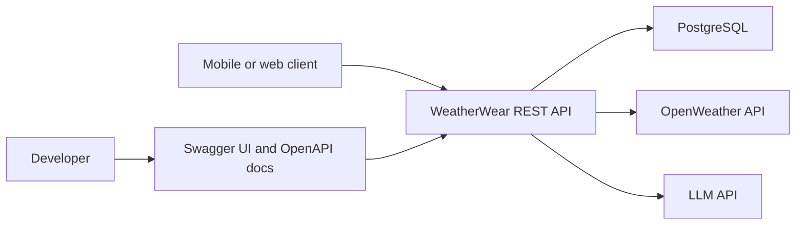
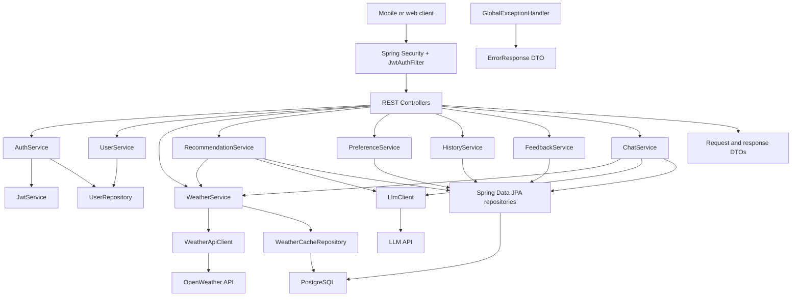
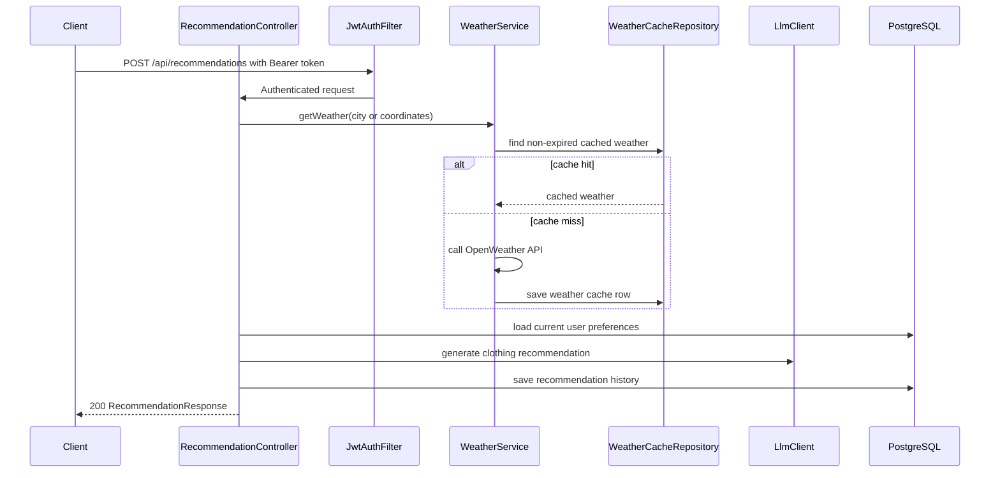
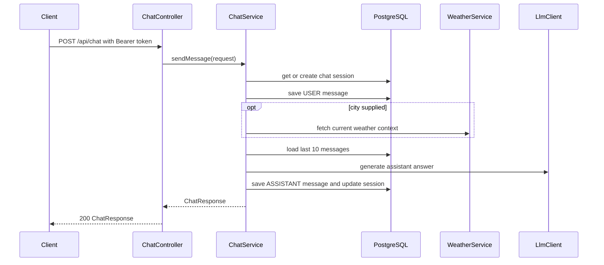
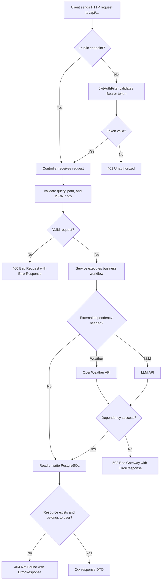

# Architecture Overview

WeatherWear is a Spring Boot REST backend. It combines user authentication, weather data, AI-generated clothing recommendations, persistence, and feedback loops.

## Diagram Coverage

| Requirement area | Diagram in this document | Purpose |
| --- | --- | --- |
| System context | System Context | Shows external actors and dependencies |
| Modules and resources | Component Diagram, Main Modules, Resource Model | Explains backend structure and ownership boundaries |
| Complex request flows | Recommendation Request Flow, Chat Request Flow | Shows step-by-step API workflows |
| Request-response lifecycle | Request-Response Lifecycle | Shows validation, authentication, dependencies, persistence, and errors |
| Dependency map | Component Diagram | Shows internal and external dependencies |

## System Context



Source file:

```text
Documentation/api/architecture/system-context.mmd
```

## Main Modules

| Module | Java package | Responsibility |
| --- | --- | --- |
| Controllers | `controller` | HTTP routing, request validation, response status selection |
| DTOs | `dto` | API request and response contracts |
| Services | `service` | Business logic and orchestration |
| Security | `security`, `config.SecurityConfig` | JWT validation, current user resolution, stateless authorization |
| Persistence | `entity`, `repository` | PostgreSQL-backed application data |
| Weather client | `client.weather` | OpenWeather integration and normalization |
| LLM client | `client.llm` | AI recommendation generation |
| Exceptions | `exception` | Error taxonomy and global error response formatting |

## Component Diagram



Source file:

```text
Documentation/api/architecture/component-diagram.mmd
```

## Resource Model

| Resource | Meaning |
| --- | --- |
| User | Account, email, BCrypt password hash, role |
| User preference | Style, sensitivity, activity, and clothing constraints |
| Weather cache | Cached OpenWeather response snapshot for 30 minutes |
| Recommendation history | Saved AI recommendation linked to a user |
| Feedback | User evaluation of a recommendation |
| Chat session | Conversation container for AI style assistant |
| Chat message | User or assistant message inside a session |

## Recommendation Request Flow



Source file:

```text
Documentation/api/architecture/recommendation-sequence.mmd
```

## Chat Request Flow



Source file:

```text
Documentation/api/architecture/chat-sequence.mmd
```

## Request Lifecycle

1. Client sends HTTP request to `/api/...`.
2. Spring Security checks whether the path is public or protected.
3. `JwtAuthFilter` validates JWT for protected endpoints.
4. Controller validates query parameters, path variables, and JSON request body.
5. Service executes business logic and calls repositories or external clients.
6. Repository persists or reads PostgreSQL data.
7. External calls to OpenWeather or LLM provider are wrapped in domain exceptions.
8. Controller returns DTO response, or `GlobalExceptionHandler` returns `ErrorResponse`.

## Request-Response Lifecycle



Source file:

```text
Documentation/api/architecture/request-lifecycle.mmd
```

## Cross-Service Contract Notes

The project is a single backend service with external provider integrations, not a multi-service microservice system. The main external contracts are:

- OpenWeather API response contract, normalized into `WeatherResponse`.
- LLM provider chat completion contract, normalized into plain recommendation text.
- PostgreSQL schema contract, documented separately in `Documentation/database_documentation.md`.
