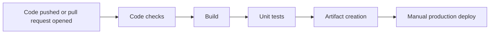

# WeatherWear CI/CD Pipeline

## Pipeline Diagram

## Tool

The project uses GitHub Actions. The workflow is stored in `.github/workflows/ci.yml` and runs on pushes and pull requests to `main`, `master`, and `develop`. Production deployment is manual through `workflow_dispatch`.

## What Is Automated

Code checks verify formatting with Spotless and lint Java sources with Checkstyle. This catches syntax/style problems before the application is built.

Build runs `mvn -B clean compile`. This checks that the Spring Boot backend compiles with Java 17.

Testing runs `mvn -B test`. These are unit and controller tests, and JaCoCo generates the coverage report.

Artifact creation runs `mvn -B package -DskipTests`, builds the executable Spring Boot JAR, builds a Docker image, saves it as a `.tar`, and uploads both as GitHub Actions artifacts.

Deployment is a manual CD stage. The workflow can trigger Railway deployment by calling the `RAILWAY_DEPLOY_HOOK_URL` secret.

## Artifacts

- Spring Boot JAR: `target/weatherwear-0.0.1-SNAPSHOT.jar`
- Docker image archive: `target/weatherwear-backend-image.tar`
- JaCoCo coverage report: `target/site/jacoco/`
- GitHub Actions build artifacts uploaded from the `package` and `test` jobs

## Environments

Dev is represented by local development and pull requests. It runs code checks, build, tests, and package validation before changes are merged.

Test is represented by the GitHub Actions `test` job. It runs automated unit/controller tests and produces the JaCoCo coverage report.

Production is Railway. Deployment is manual from GitHub Actions and requires the `RAILWAY_DEPLOY_HOOK_URL` secret.
