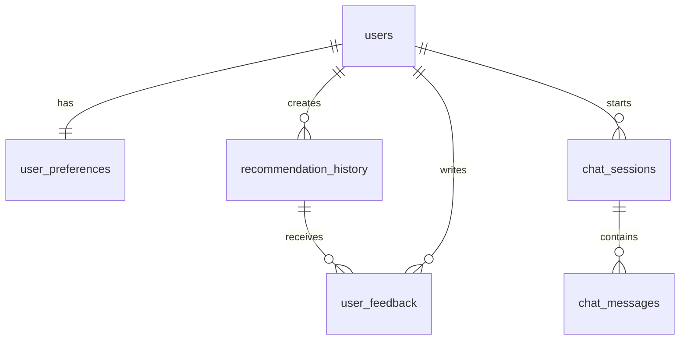

# WeatherWear Database Documentation

Reviewed: 2026-04-30

## 1. Scope and DBMS Choice

WeatherWear uses a relational transactional database because the main data is structured application data: users, preferences, chat sessions, messages, recommendation history, feedback, and cached weather responses. The project uses PostgreSQL 16 through Spring Data JPA and Flyway migrations.

This project belongs to the Transactional Database (OLTP) category. OLAP and NoSQL are not required for the current scope because the application does not implement a separate analytical warehouse and does not require a document, graph, key-value, or column-family database as a core storage model. Weather cache is a helper table inside the OLTP database, not a separate database part.

## 2. Requirement Coverage

| Requirement | Status | Project artifact |
| --- | --- | --- |
| Modern relational DBMS | Done | PostgreSQL 16 in `docker-compose.yml` |
| Database structure created by scripts/migrations | Done | `src/main/resources/db/migration/V1__init_schema.sql`, `V2__database_integrity_and_reporting.sql` |
| DDL script in version control | Done | Flyway migration files |
| Data dictionary | Done | Section 5 of this document |
| Logical schema | Done | `Documentation/database_schema.mmd` and section 4 |
| Keys and relationships | Done | PK/FK/UNIQUE constraints in migrations |
| Data integrity constraints | Done | NOT NULL, UNIQUE, FK, CHECK constraints, triggers |
| Transactions | Done | Spring Data transaction boundaries, explicit `@Transactional`, SQL test-data transaction |
| Test data | Done | `src/main/resources/db/testdata/weatherwear_test_data.sql` |
| Roles and access rights | Done | `src/main/resources/db/security/roles_and_grants.sql`, Docker init app user |
| Application must not run under superuser | Done for Docker setup | Backend uses `APP_DB_USER` / `APP_DB_PASSWORD`; PostgreSQL admin user is separate |
| Passwords encrypted | Done | BCrypt in `SecurityConfig`; test data stores BCrypt hashes only |
| Indexes | Done | User, cache, history, feedback, chat indexes in V1 |
| Views / masking | Done | `v_anonymized_users`, `v_user_recommendation_summary` in V2 |
| Triggers / UDF | Done | `weatherwear_set_updated_at`, `weatherwear_mask_email` in V2 |

## 3. Deployment and Versioning

Flyway is the source of truth for the database structure. Production profile enables Flyway and validates JPA mappings:

- `spring.flyway.enabled=true`
- `spring.jpa.hibernate.ddl-auto=validate`

Version history is stored in Git through migration files:

- `V1__init_schema.sql`: base tables, primary keys, foreign keys, initial checks, indexes.
- `V2__database_integrity_and_reporting.sql`: additional integrity checks, triggers, masking function, reporting views.

Manual database changes should not be applied directly in production. Every structure change should be added as a new migration, for example `V3__add_new_feature.sql`.

For local Docker deployment, PostgreSQL starts with an admin account (`weatherwear_db_admin`), and the application connects through a separate non-superuser login (`weatherwear_app` by default). The app credentials must be stored in `.env`, GitHub Secrets, Railway variables, or another secure secret storage. They must not be committed to Git.

## 4. Logical Schema

The submitted image is used as the visual reference, but the current source of truth is the Flyway schema. One difference is important: the image shows `recommendation_history.weather_id`, but the current application stores a weather snapshot in `weather_summary` and does not have a foreign key from `recommendation_history` to `weather_cache`.



Main blocks:

| Block | Tables | Purpose |
| --- | --- | --- |
| Identity | `users` | Authentication, roles, account timestamps |
| Personalization | `user_preferences` | Style, weather sensitivity, activity preferences |
| Weather | `weather_cache` | Temporary cached weather data from external API |
| Recommendations | `recommendation_history`, `user_feedback` | Generated outfit advice and user evaluation |
| Chat | `chat_sessions`, `chat_messages` | Conversational style assistant history |

## 5. Data Dictionary

### users

| Column | Type | Keys / constraints | Quality expectation |
| --- | --- | --- | --- |
| `id` | `BIGSERIAL` | PK | Generated by database |
| `email` | `VARCHAR(255)` | UNIQUE, NOT NULL, email format CHECK | Valid e-mail, unique account identifier |
| `password` | `VARCHAR(255)` | NOT NULL | BCrypt hash, never plain text |
| `role` | `VARCHAR(30)` | NOT NULL, CHECK `USER`/`ADMIN` | Application authorization role |
| `created_at` | `TIMESTAMP` | NOT NULL, default `NOW()` | Creation time |
| `updated_at` | `TIMESTAMP` | trigger-maintained | Last update time |

### user_preferences

| Column | Type | Keys / constraints | Quality expectation |
| --- | --- | --- | --- |
| `id` | `BIGSERIAL` | PK | Generated by database |
| `user_id` | `BIGINT` | FK to `users(id)`, UNIQUE, NOT NULL, ON DELETE CASCADE | Exactly one preference record per user |
| `style_preference` | `VARCHAR(30)` | NOT NULL, enum CHECK | One of supported style values |
| `cold_sensitivity` | `VARCHAR(20)` | NOT NULL, enum CHECK | `LOW`, `MEDIUM`, or `HIGH` |
| `heat_sensitivity` | `VARCHAR(20)` | NOT NULL, enum CHECK | `LOW`, `MEDIUM`, or `HIGH` |
| `wind_sensitivity` | `VARCHAR(20)` | NOT NULL, enum CHECK | `LOW`, `MEDIUM`, or `HIGH` |
| `rain_sensitivity` | `VARCHAR(20)` | NOT NULL, enum CHECK | `LOW`, `MEDIUM`, or `HIGH` |
| `max_layers` | `SMALLINT` | NOT NULL, CHECK 1..5 | Reasonable clothing layer count |
| `prefers_headwear` | `BOOLEAN` | NOT NULL | Headwear preference |
| `prefers_waterproof` | `BOOLEAN` | NOT NULL | Waterproof clothing preference |
| `activity_level` | `VARCHAR(20)` | NOT NULL, enum CHECK | `LOW`, `MEDIUM`, or `HIGH` |
| `preferred_colors` | `VARCHAR(255)` | nullable | Optional comma-separated color preference |
| `avoid_items` | `VARCHAR(255)` | nullable | Optional items to avoid |
| `created_at` | `TIMESTAMP` | NOT NULL | Creation time |
| `updated_at` | `TIMESTAMP` | trigger-maintained | Last update time |

### weather_cache

| Column | Type | Keys / constraints | Quality expectation |
| --- | --- | --- | --- |
| `id` | `BIGSERIAL` | PK | Generated by database |
| `city` | `VARCHAR(120)` | indexed | City name from request/API |
| `latitude` | `DOUBLE PRECISION` | CHECK -90..90 | Valid latitude or NULL |
| `longitude` | `DOUBLE PRECISION` | CHECK -180..180 | Valid longitude or NULL |
| `temperature` | `DOUBLE PRECISION` | reasonable range CHECK | Celsius temperature |
| `feels_like` | `DOUBLE PRECISION` | reasonable range CHECK | Celsius perceived temperature |
| `humidity` | `INT` | CHECK 0..100 | Percent humidity |
| `wind_speed` | `DOUBLE PRECISION` | CHECK >= 0 | Wind speed from API |
| `condition` | `VARCHAR(50)` | enum CHECK | Supported weather condition |
| `precipitation` | `DOUBLE PRECISION` | CHECK >= 0 | Precipitation amount |
| `cached_at` | `TIMESTAMP` | NOT NULL | Cache creation time |
| `expires_at` | `TIMESTAMP` | NOT NULL, indexed | Cache expiry time |

### recommendation_history

| Column | Type | Keys / constraints | Quality expectation |
| --- | --- | --- | --- |
| `id` | `BIGSERIAL` | PK | Generated by database |
| `user_id` | `BIGINT` | FK to `users(id)`, NOT NULL, ON DELETE CASCADE | Owner of recommendation |
| `city` | `VARCHAR(120)` | nullable | City used for recommendation |
| `weather_summary` | `VARCHAR(1000)` | nullable | Weather snapshot stored at recommendation time |
| `recommendation_text` | `TEXT` | nullable | Generated clothing advice |
| `created_at` | `TIMESTAMP` | NOT NULL | Recommendation time |

### user_feedback

| Column | Type | Keys / constraints | Quality expectation |
| --- | --- | --- | --- |
| `id` | `BIGSERIAL` | PK | Generated by database |
| `recommendation_history_id` | `BIGINT` | FK to `recommendation_history(id)`, NOT NULL, ON DELETE CASCADE | Feedback target |
| `user_id` | `BIGINT` | FK to `users(id)`, NOT NULL, ON DELETE CASCADE | Feedback author |
| `feedback_type` | `VARCHAR(30)` | NOT NULL, enum CHECK | `RATING`, `LIKE`, `DISLIKE`, `COMMENT` |
| `rating` | `SMALLINT` | CHECK 1..5 | Optional numeric rating |
| `comment` | `TEXT` | nullable | Optional text comment |
| `created_at` | `TIMESTAMP` | NOT NULL | Feedback time |

### chat_sessions

| Column | Type | Keys / constraints | Quality expectation |
| --- | --- | --- | --- |
| `id` | `BIGSERIAL` | PK | Generated by database |
| `user_id` | `BIGINT` | FK to `users(id)`, NOT NULL, ON DELETE CASCADE | Session owner |
| `title` | `VARCHAR(255)` | NOT NULL, default `Style chat` | Human-readable session title |
| `created_at` | `TIMESTAMP` | NOT NULL | Creation time |
| `updated_at` | `TIMESTAMP` | trigger-maintained | Last message/update time |

### chat_messages

| Column | Type | Keys / constraints | Quality expectation |
| --- | --- | --- | --- |
| `id` | `BIGSERIAL` | PK | Generated by database |
| `session_id` | `BIGINT` | FK to `chat_sessions(id)`, NOT NULL, ON DELETE CASCADE | Parent chat session |
| `role` | `VARCHAR(30)` | NOT NULL, enum CHECK | `USER`, `ASSISTANT`, or `SYSTEM` |
| `content` | `TEXT` | NOT NULL, not blank CHECK | Message text |
| `created_at` | `TIMESTAMP` | NOT NULL | Message time |

## 6. Normalization and Relationships

The schema is normalized to 3NF:

- User identity data is stored only in `users`.
- User style settings are separated into `user_preferences` with a one-to-one relationship.
- Generated recommendations are separated from feedback to avoid repeating feedback attributes for each recommendation row.
- Chat sessions are separated from chat messages to support one-to-many conversation history.
- Weather cache is isolated because cached external API data has a different lifecycle from user-owned recommendation history.

Relationship types:

- One-to-one: `users` to `user_preferences`.
- One-to-many: `users` to `recommendation_history`, `users` to `chat_sessions`, `chat_sessions` to `chat_messages`.
- Many-to-one: `user_feedback` points to both `users` and `recommendation_history`.

## 7. Integrity and Transactions

Data integrity is maintained through:

- Primary keys on all tables.
- Foreign keys with `ON DELETE CASCADE` for user-owned data.
- Unique constraints for `users.email` and `user_preferences.user_id`.
- CHECK constraints for enum-like values, ratings, humidity, coordinates, weather numeric ranges, message content, and feedback content.
- Triggers for `updated_at` consistency.
- Application-level validation through Jakarta Validation DTO annotations.

Transactions:

- Spring Data JPA repository methods run inside Spring transaction boundaries.
- `HistoryService.clearCurrentUserHistory()` is explicitly marked with `@Transactional`.
- Flyway runs migrations transactionally where PostgreSQL supports transactional DDL.
- Test data script uses explicit `BEGIN` / `COMMIT`, so partial seed data is not left behind if an insert fails.

## 8. Indexes

The schema includes indexes that match application query patterns:

| Index | Purpose |
| --- | --- |
| `idx_user_preferences_user_id` | Fast lookup of preferences by user |
| `idx_weather_cache_city` | Cache lookup by city |
| `idx_weather_cache_coordinates` | Cache lookup by latitude/longitude |
| `idx_weather_cache_expires_at` | Cleanup or freshness checks |
| `idx_recommendation_history_user_id` | Recommendation history by user |
| `idx_user_feedback_user_id` | Feedback list by user |
| `idx_user_feedback_recommendation_history_id` | Feedback by recommendation |
| `idx_chat_sessions_user_id` | Chat sessions by user |
| `idx_chat_messages_session_id` | Chat messages by session |

## 9. Roles and Security

The project defines least-privilege database roles:

| Role | Purpose |
| --- | --- |
| `app_read` | Read-only access to tables and views |
| `app_write` | Application read/write access |
| `app_admin` | Schema management and administrative access |

The local Docker setup creates the application login user from `APP_DB_USER` / `APP_DB_PASSWORD`. This user is granted application-level permissions and is not a PostgreSQL superuser. The PostgreSQL admin user is only used for database initialization.

Passwords and tokens must be stored only in secure storage:

- Local `.env` file, not committed to Git.
- GitHub Secrets for CI/CD.
- Railway variables for production.

User passwords are stored as BCrypt hashes through Spring Security `BCryptPasswordEncoder`.

## 10. Views, Masking, and Reporting

`V2__database_integrity_and_reporting.sql` adds:

- `weatherwear_mask_email(input_email TEXT)`: masks e-mail addresses.
- `v_anonymized_users`: exposes user metadata without full e-mail or password hashes.
- `v_user_recommendation_summary`: aggregates recommendations, feedback count, average rating, and latest recommendation date.

These objects support reporting and personal-data minimization without exposing raw user credentials or full e-mail addresses.

## 11. Test Data

The test data script is:

`src/main/resources/db/testdata/weatherwear_test_data.sql`

It inserts:

- demo users with BCrypt password hashes,
- preferences covering normal and edge cases,
- weather cache records for rain, snow, clouds, and extreme heat,
- recommendation history,
- user feedback,
- chat session and messages.

Run it only in local or test databases:

```bash
psql "$DATABASE_URL" -f src/main/resources/db/testdata/weatherwear_test_data.sql
```

## 12. Restrictions Compliance

The project does not use CSV or Excel files as primary storage. It does not store passwords in plain text. It does not use JSON as an unstructured substitute for a relational model. Database integrity is not ignored: keys, constraints, indexes, transactions, migrations, and permission scripts are all present in version control.

## 13. How to Verify

1. Start a fresh local database:

```bash
docker compose down -v
docker compose up --build
```

2. Check that migrations are applied:

```sql
SELECT version, description, success
FROM flyway_schema_history
ORDER BY installed_rank;
```

3. Check that the backend is not using a superuser:

```sql
SELECT rolname, rolsuper
FROM pg_roles
WHERE rolname IN ('weatherwear_app', 'app_read', 'app_write', 'app_admin');
```

4. Check tables and views:

```sql
\dt
\dv
SELECT * FROM v_user_recommendation_summary;
```

5. Load demo data in a local/test database:

```bash
psql "$DATABASE_URL" -f src/main/resources/db/testdata/weatherwear_test_data.sql
```

6. Confirm password hashes are not plain text:

```sql
SELECT email, password LIKE '$2%' AS is_bcrypt_hash
FROM users;
```
